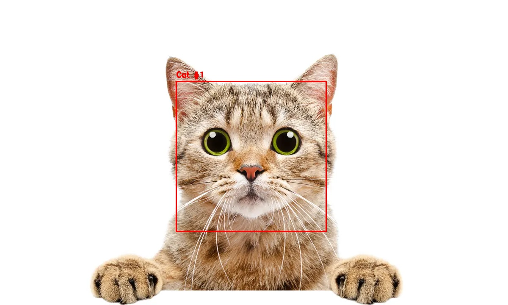
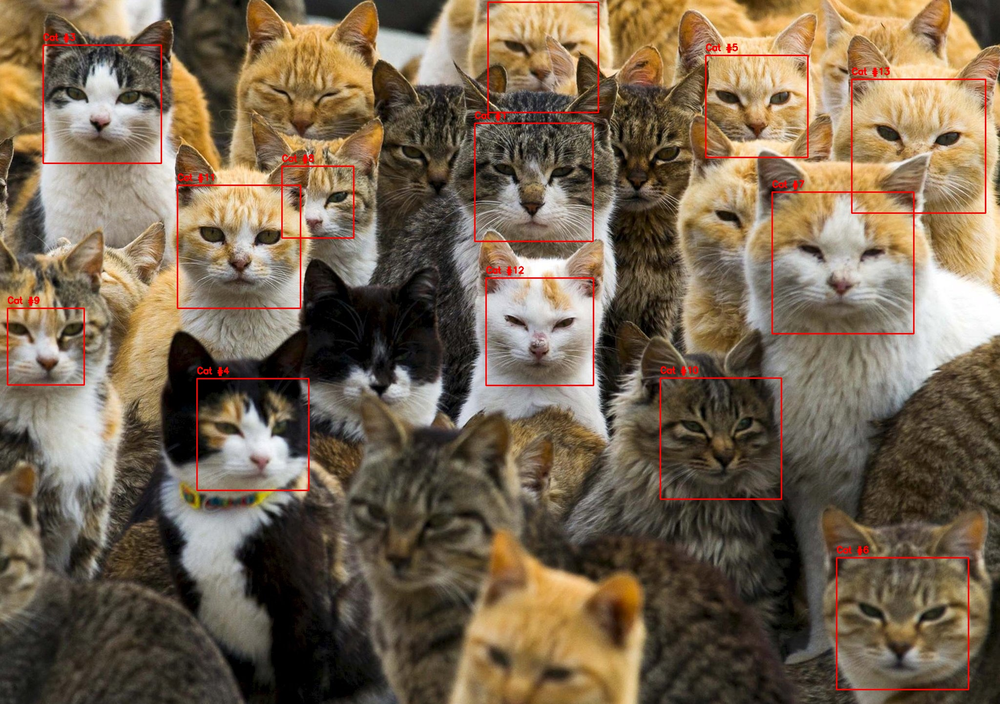

### **Cat Face Detector: Detecting Feline Faces Using OpenCV**


## **📌 Project Description**  
This project detects **cat faces** in images using **Haar Cascade Classifier** in **OpenCV**.  
The program loads images, applies **face detection**, and saves the results with bounding boxes and annotations.

🔹 Uses **pre-trained Haar Cascade model** for cat face detection.  
🔹 Supports multiple images with customizable detection settings.  
🔹 Saves output images after detection.  


## **📂 Project Structure**
```
📦 cat-detector
 ┣ 📂 images
 ┃ ┣ 📄 image.webp         # Sample cat image 1
 ┃ ┗ 📄 image2.jpg        # Sample cat image 2
 ┣ 📂 models
 ┃ ┗ 📄 haarcascade_frontalcatface_extended.xml  # Pre-trained Haar Cascade model
 ┣ 📂 outputs
 ┃ ┣ 📄 result1.jpg       # Output with detected cat faces (image 1)
 ┃ ┗ 📄 result2.jpg       # Output with detected cat faces (image 2)
 ┣ 📄 cat_detector.py     # Main script for detection
 ┗ 📄 README.md           # Project documentation
```


## **🚀 How It Works**
1️⃣ **Loads input images from the `images/` folder**  
2️⃣ **Applies Haar Cascade classifier for cat face detection**  
3️⃣ **Draws bounding boxes around detected faces**  
4️⃣ **Saves the output images in `outputs/` with the detection results**  


## **📌 Setup & Installation**
Make sure you have the required dependencies installed. Run:

```sh
pip install opencv-python opencv-python-headless matplotlib
```


## **📌 Running the Project**
Execute the following command to run the detection script:

```sh
python cat_detector.py
```


## **📸 Sample Results**

### **🔹 Before Detection**
#### **Original Images**
| Original Image 1 | Original Image 2 |
|--|--|
|  |  |


### **🔹 After Detection**
#### **Detected Cat Faces**
| Detected Image 1 | Detected Image 2 |
|--|--|
|  |  |


## **🛠 Technologies Used**
- **Python** 🐍  
- **OpenCV** 📷 (for face detection)  
- **Matplotlib** 📊 (for visualization)  
